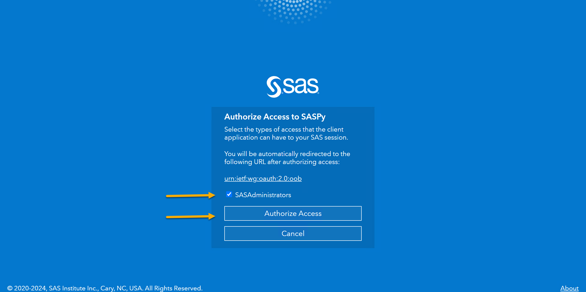
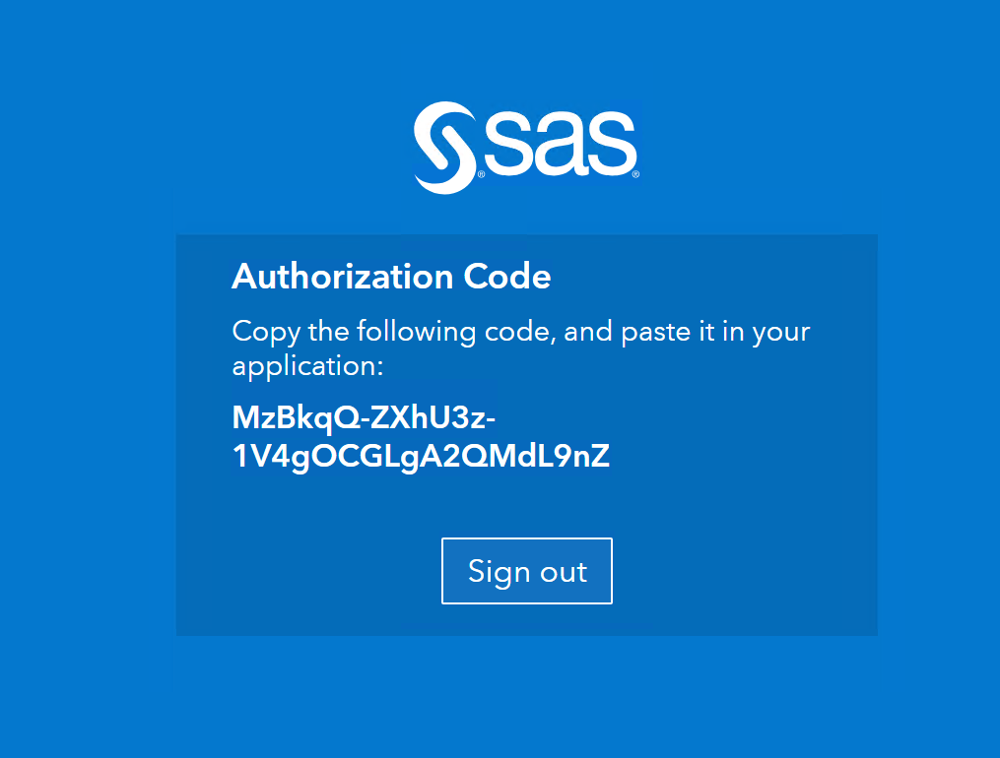

# SAS Viya Data Analysis Assistant with Azure OpenAI

## Introduction

Data querying and data analysis using natural language on any dataset is now possible with Azure OpenAI's Assistant API, specifically through its Function Calling feature. It empowers users to perform complex data analyses without technical skills, focusing on insights rather than programming.

This Python script is a command-line assistant that interacts with SAS Viya data using natural language queries. It leverages Azure OpenAI to interpret user questions and execute corresponding SAS code via the `saspy` library. The assistant can perform data queries, provide metadata information, and assist with data analysis tasks using SAS Viya.

## Prerequisites

Before running the program, ensure that you have the following prerequisites installed and configured:

- **Python 3.7 or higher**

- **SAS Viya environment**: Access to a SAS Viya server and the necessary permissions.

- **Azure OpenAI Service**: An Azure OpenAI deployment with a model that supports function calling (e.g., GPT-4o).

- **Visual Studio Code (optional)**: Recommended IDE for editing and running the script.

- **Required Python Packages**: Listed in `requirements.txt`.

### Required Python Packages

The following Python packages are required:

- `openai`
- `python-dotenv`
- `termcolor`
- `saspy`
- `re`

You can install them using pip and the provided `requirements.txt` file.

## Installation

### Clone the Repository

```bash
repository_url=https://github.com/bteleuca/sas-viya-azure-openai-integrations.git
repository_folder=sas-viya-azure-openai-integrations/data_query_using_natural_language
git clone $repository_url
cd $repository_folder
ls

```

### Install Required Packages

Install the required Python packages using `pip`:

```bash
pip install -r requirements.txt
```

### Configure Environment Variables

Create a `.env` file in the same directory as the script with the following environment variables:

```dotenv
OPENAI_URI=<Your Azure OpenAI Endpoint>
OPENAI_KEY=<Your Azure OpenAI API Key>
OPENAI_VERSION=<Your Azure OpenAI API Version>
OPENAI_GPT_DEPLOYMENT=<Your OpenAI Model Deployment Name>
```

Replace the placeholders with your actual Azure OpenAI service details.

---
Note: The Assistant was tested with **GPT-4o**, API version `2024-02-15-preview`.

---

### Configure `sascfg_personal.py`

Ensure that you have a `sascfg_personal.py` file in the same directory as the script. This file is used by `saspy` to connect to your SAS Viya server. The script will update the `url` parameter in this file based on your input.

An example `sascfg_personal.py`:

```python
SAS_config_names=['httpsviya']

SAS_config_options = {'lock_down': False,
                      'verbose'  : True,
                      'prompt'   : True
                     }

SAS_output_options = {'output' : 'html5'}       # not required unless changing any of the default

httpsviya = {'url' : 'https://your-sas-viya-url.com',
             'context' : 'SAS Studio compute context',
             'options' : ["fullstimer", "memsize=4G"],
             'verify' : False
             }
```

There are many ways to connect to a SAS Viya environment using SASPY. The above will generate a link, ask you to log in using your credentials. An authorization code will be generated. To complete the authentication, paste the authentication code when asked by the Python program.

## Usage

### Running the Assistant

To start the assistant, run the script:

```bash
python demo-function-calling-sas.py
```

### Steps During Execution

1. **SAS Viya URL Configuration**:

   - The script will prompt you to enter your SAS Viya URL.

     ```
     Enter your SAS Viya URL, for example: https://your-sas-viya-url.com:
     ```

   - Provide the URL, and the script will update `sascfg_personal.py` accordingly.

2. **Starting SAS Session**:

   - The script will start a SAS session using the updated configuration.

     ```
     I am starting a SAS session. Thanks for your patience...
     I am starting a SAS session. Thanks for your patience...
     To connect to Viya you need either an authcode or a userid/pw. Neither were provided.
     Please enter which one you want to enter next. Type one of these now: [default=authcode | userid]:
     The PKCE required url to authenticate with is https://your-sas-viya-url.com/SASLogon/oauth/authorize?client_id=SASPy&response_type=code&code_challenge_method=S256&code_challenge=SfpVy5-mfUI6MBKYk5HTOmM5wh6yG3vOdlWsKW4-Bm0
     ```

    - Press ENTER for the default method.
    - A link will be generated, for instance `https://your-sas-viya-url.com/SASLogon/oauth/authorize?client_id=SASPy&response_type=code&code_challenge_method=S256&code_challenge=SfpVy5-mfUI6MBKYk5HTOmM5wh6yG3vOdlWsKW4-Bm0`
    - Copy the link, paste it in a browser and authenticate in your SAS Viya environment.

    

    - An authorization code wil be generated.

    

    - Paste it back in the Python command line:

     ```
    Please enter authcode: MzBkqQ-ZXhU3z-1V4gOCGLgA2QMdL9nZ
     ```
    - A session will start: `SAS server started using Context SAS Studio compute context with SESSION_ID=843d1bda-******-ses0000`

3. **Library and Table Selection**:

   - The script initially selects a default library and table (`sampsio.dmlcens`).

     ```
     Library and table selected: sampsio and dmlcens
     ```

   - It fetches the table metadata for later use.
     ```
                                      Obs    NAME        TYPE    LENGTH    LABEL    FORMAT    INFORMAT

                                    1    age           1        8
                                    2    cap_gain      1        8
                                    3    cap_loss      1        8
                                    4    class         2        5
                                    5    country       2       26
                                    6    country2      2       26
                                    7    educ          2       12
                                    8    educ_num      1        8
                                    9    fnlwgt        1        8
                                   10    hourweek      1        8
                                   11    marital       2       21
                                   12    occupatn      2       17
                                   13    race          2       18
                                   14    relation      2       14
                                   15    sex           2        6
                                   16    workcla2      2       16
                                   17    workclas      2       16
     ```

4. **User Interaction**:

   - The assistant enters a loop where it waits for your input.

     ```
     SAS Viya and Azure OpenAI are listening. Write 'help' to get suggestions, 'change' to switch tables, 'stop' or press Ctrl-Z to end.
     Enter your question:
     ```

   - You can ask natural language questions about the data.

### Commands

- **`help`**:

- The assistant will provide suggestions on types of questions you can ask:

- Enter a question, such as: `What is the distribution of education levels?`:

- Enter other question about the data set.


- **`change`**:

  - Allows you to change the current library and table.

    ```
    Enter the library name:
    Enter the table name:
    ```

  - The assistant will update the table metadata accordingly.

- **`stop`**:

  - Ends the conversation and terminates the SAS session.

    ```
    Conversation ended.
    ```

### Example Usage

#### Asking for Help

```
Enter your question:
help
```

**Assistant**:

```
You can ask me questions about the data, such as:

- "Describe the data set."
- "What is the proportion of people making a capital loss?"
- "What are the most frequent revenue classes in the data?"
- "Which professions have a revenue class greater than 50K and are making a capital loss?"

How can I assist you today?
```

#### Changing the Table

```
Enter your question:
change
Enter the library name:
mylib
Enter the table name:
employees
Library and table selected: mylib and employees
I am going to use this table metadata: ...
```

#### Asking a Data Question

```
Enter your question:
What is the distribution of education levels?
```

Possible answer:

```
Executing function tool call
Function Name: execute_sas_code
Arguments: {'sas_code': 'proc sql;\n   select educ, count(*) as frequency\n   from sampsio.dmlcens\n   group by educ;\nquit;'}
                                                        The SAS System                  Friday, December 20, 2024 03:39:00 AM   2

                                                    educ          frequency
                                                    -----------------------
                                                    10th                933
                                                    11th               1175
                                                    12th                433
                                                    1st-4th             168
                                                    5th-6th             333
                                                    7th-8th             646
                                                    9th                 514
                                                    Assoc-acdm         1067
                                                    Assoc-voc          1382
                                                    Bachelors          5355
                                                    Doctorate           413
                                                    HS-grad           10501
                                                    Masters            1723
                                                    Preschool            51
                                                    Prof-school         576
                                                    Some-college       7291

```

**Assistant**:

```
Here is the distribution of education levels in the dataset:

- 10th: 933
- 11th: 1175
- 12th: 433
- 1st-4th: 168
- 5th-6th: 333
- 7th-8th: 646
- 9th: 514
- Assoc-acdm: 1067
- Assoc-voc: 1382
- Bachelors: 5355
- Doctorate: 413
- HS-grad: 10501
- Masters: 1723
- Preschool: 51
- Prof-school: 576
- Some-college: 7291
```

#### Ending the Session

```
Enter your question:
stop
Conversation ended.
```

## Additional Notes

- **Error Handling**: The assistant includes basic error handling to log messages and handle exceptions gracefully.

- **Function Execution**: The assistant uses Azure OpenAI's function calling feature to decide when to execute SAS code based on your questions.

- **SAS Code Execution**: All SAS code execution is performed via the `saspy` library, which interfaces with SAS Viya.

## Support

We use GitHub for tracking bugs and feature requests. Please submit a GitHub issue or pull request for support.